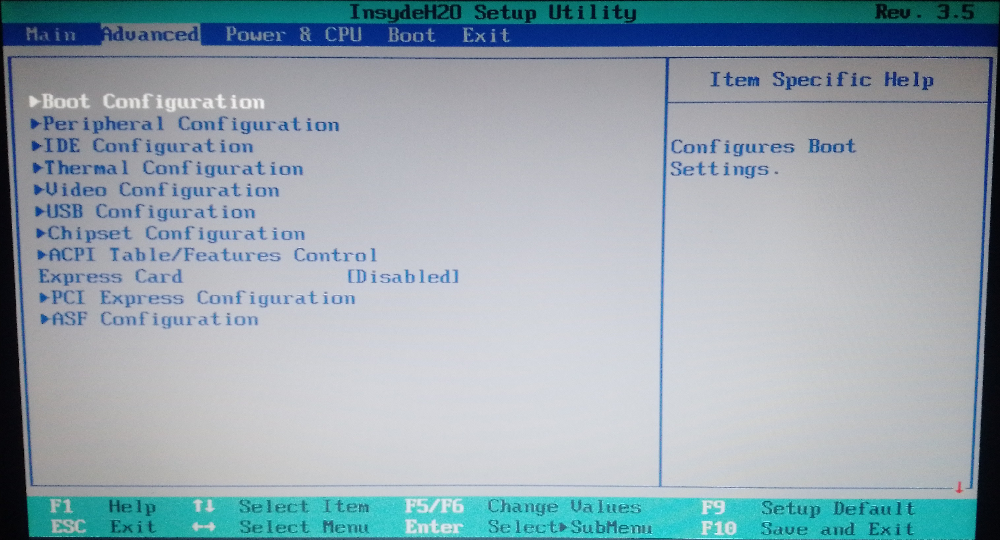
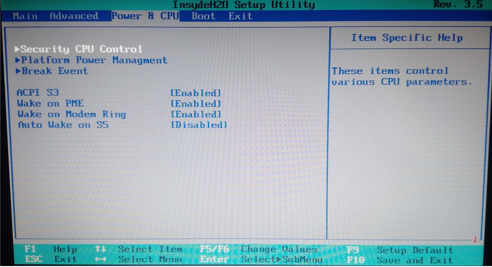
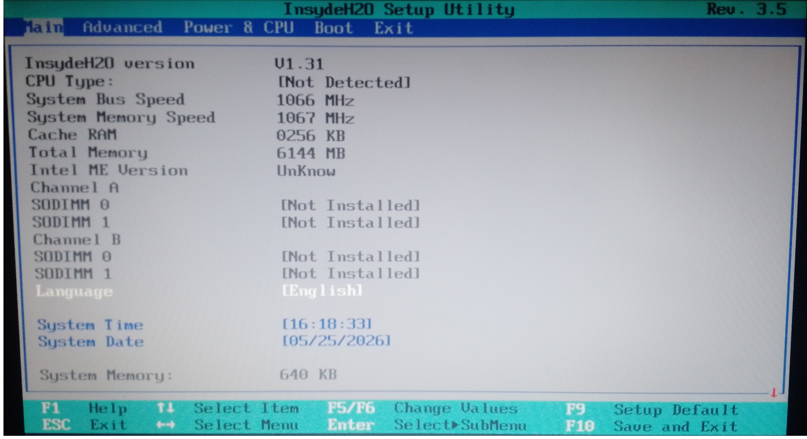
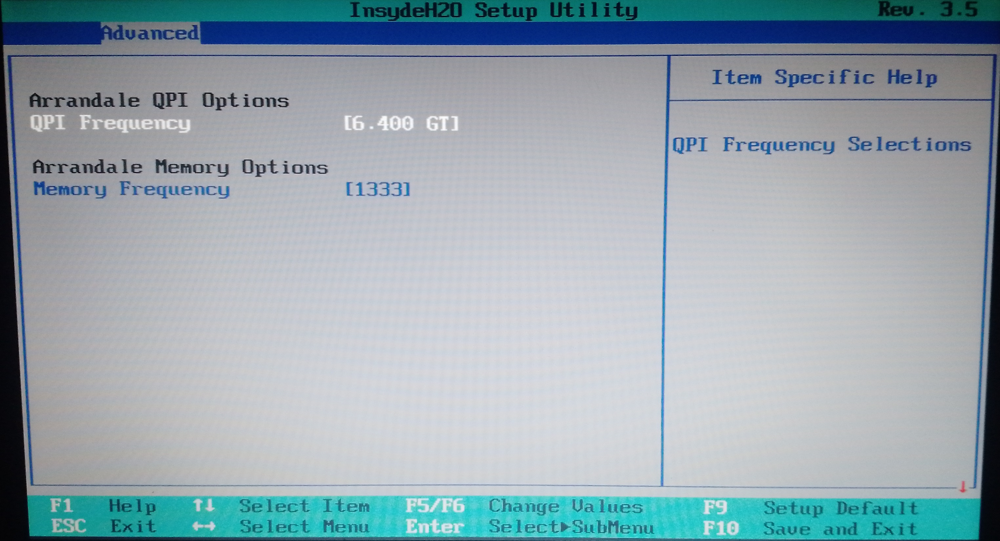
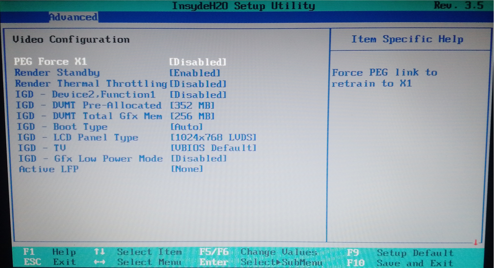
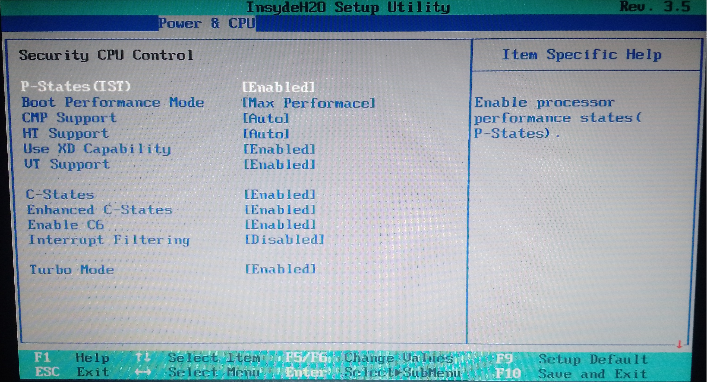

# 🛠️ Acer Aspire 5742G BIOS Unlock (Advanced & Power Menus) + Custom Logo

[ 🇷🇺 Русский ](#ru) | [ 🇬🇧 English ](#en)

  <i>Разблокировка скрытых инженерных меню InsydeH2O и свой загрузочный логотип — на ноутбуке 2010 года, который обычно уже списали.</i>

---

 

<h2 id="ru">🇷🇺 Русский (Описание)</h2>

  
<b>🧭 Содержание</b>

   

  * [❓ Сначала ответьте себе на три вопроса](#ru-questions)
  * [💻 Что и на чём проверялось](#ru-hw)
  * [✅ Что реально изменено в дампе](#ru-changes)
  * [📁 Содержимое репозитория](#ru-repo)
  * [🧰 Необходимый инструментарий](#ru-tools)
  * [🛠️ Инструкции по модификации](#ru-instr)
  * [🔌 Инструкция по прошивке](#flash-ru)
  * [🔍 Программатор не определяется? Порядок проверки](#ru-diag)
  * [🚑 Если ноутбук не включился после прошивки](#ru-recovery)

В репозитории лежат дампы BIOS ноутбука **Acer Aspire 5742G** и подробная инструкция по разблокировке скрытых инженерных меню (`Advanced` и `Power & CPU`), замене загрузочного логотипа и правке значения Power Limit вручную.

Способ — **подмена масок (Form ID) в модуле `SetupUtility`**: BIOS начинает открывать инженерную форму вместо стандартной, ничего не пересобирая «с нуля» и не затрагивая остальные тома.

> [!NOTE]
> **🔍 Ключевые слова для поиска:** LA-5894P dump, Compal PEW71 BIOS, Acer 5742G hidden menu unlock, InsydeH2O SetupUtility mask, Acer 5742G BIOS unlock.

> [!IMPORTANT]
> ### 🚦 Сначала ответьте себе на три вопроса
> **1. Это вообще про ваши тормоза?** Разблокировка меню сама по себе ноутбук не ускоряет — она даёт доступ к настройкам. Если 5742G тормозит, сначала смотрите в сторону SSD вместо HDD, памяти и охлаждения: BIOS этого не заменит.
> **2. Есть ли у вас второй рабочий компьютер?** Он обязателен. Если прошивка не встанет, откатывать будет нечем.
> **3. Готовы ли возиться с программатором?** Нужен CH341A с прищепкой, разборка ноутбука и понимание, что часть инженерных пунктов плата всё равно может сбросить.
> Если хотя бы на один вопрос ответ «нет» — отнесите ноутбук в мастерскую. Это нормальный путь, а не поражение.

> [!CAUTION]
> ### ⚠️ КРИТИЧЕСКИЕ ПРЕДУПРЕЖДЕНИЯ (ЧИТАТЬ ОБЯЗАТЕЛЬНО!)
> 1. **ТОЛЬКО ПРОГРАММАТОР.** Прошивка модифицированного BIOS должна производиться **СТРОГО** через аппаратный программатор (например, CH341A) с прищепкой или через выпаивание чипа памяти.
> 2. **ПРОШИВКА ИЗ WINDOWS НЕ РАБОТАЕТ.** Штатные утилиты (InsydeFlash и др.) из-под ОС этот мод не примут: уйдёт ошибка проверки, образ будет отклонён, а состояние ноутбука станет непредсказуемым. На этой модели **внешнего пути восстановления в самом BIOS нет** — проверено на практике.
> 3. **ОБЕСТОЧЬТЕ ПЛАТУ.** Перед подключением прищепки **ОБЯЗАТЕЛЬНО** отключите блок питания и снимите аккумуляторную батарею.
> 4. **СДЕЛАЙТЕ БЭКАП.** Считайте свой оригинальный BIOS программатором минимум 2–3 раза. Файлы должны совпадать по SHA256. Если разные — прищепка стоит криво, читать и шить так нельзя.
> 5. **ЗАПАСНОЙ ПК.** Не приступайте к прошивке, если рядом нет второго рабочего компьютера: он понадобится, чтобы залить оригинальный дамп обратно.
> 6. **АППАРАТНЫЕ ОГРАНИЧЕНИЯ.** Часть инженерных пунктов плата принимает не всегда: значение может вернуться к заводскому при перезагрузке. Причин несколько — политика EC, значение в другом хранилище настроек, или то, что референс-код просто не читает этот пункт.

> [!WARNING]
> **ВСЕ ДЕЙСТВИЯ ВЫ ВЫПОЛНЯЕТЕ ИСКЛЮЧИТЕЛЬНО НА СВОЙ СТРАХ И РИСК!** Автор репозитория не несёт ответственности за вышедшее из строя оборудование.

  
<b>📸 Скриншоты разблокированного BIOS</b>

   
  
    
  
    
  
    

  

    
<b> Дополнительные </b>

     
     
       
     
       
      Security CPU Control" width="600">
       
    

---

> [!NOTE]
> **Что понадобится, чтобы повторить:** плата Compal PEW71 / LA-5894P, программатор CH341A с прищепкой, второй рабочий компьютер для отката — и бэкап оригинала, снятый **до** прошивки, а не после.

## 💻 Тест проводился исключительно на данных комплектующих:
* **Модель ноутбука:** Acer Aspire 5742G
* **Платформа (материнская плата):** Compal PEW71 / LA-5894P
* **Ревизия платы (Rev):** 1.0
* **Объём чипа BIOS:** 4 МБ (4 194 304 байта)
* **Прошивка:** InsydeH2O

*(Внимание: комплектующие у ноутбуков этой линейки могут отличаться. ОБЯЗАТЕЛЬНО сохраните свой исходный дамп перед прошивкой!)*

---

## ✅ Что реально изменено в этом дампе

Ниже — **фактический состав правки**, проверенный сравнением стокового и модифицированного образов байт в байт.

| # | Что сделано | Где в образе |
|---|---|---|
| 1 | **Подмена масок в меню** — форма `Information` и форма `Power` поменялись местами; формы `Security` и `Advanced` обменялись содержимым | модуль `SetupUtility`, таблица меню |
| 2 | **Косметическое переименование** — пункт `Harddisk Security` стал `Harddisk Advanced`, добавлена подпись `Power` с выравниванием по длине | строки (Unicode) в `SetupUtility` |
| 3 | **Power Limit** — значение по умолчанию проставлено вручную через hex-редактор (`800`), потому что в интерфейсе пункт выставлялся некорректно и периодически сбивался | форма `Power & CPU` |
| 4 | **Загрузочный логотип** — штатная заставка заменена на свою (H2OEZE) | блок растра ≈ 201 КБ в DXE-томе |

### Границы правки

Во всём четырёхмегабайтном образе отличаются **только DXE firmware volume** и 22 байта его заголовка. Метаданные платы не тронуты:

* Intel ME регион — **побайтово идентичен** стоковому
* Flash descriptor, PEI-том, SMM, загрузочный блок — **идентичны**
* DMI-данные и серийные номера — **идентичны**

То есть образ не тащит в себе чужие серийники и чужой ME, откат чистый, и риск ограничен одним томом.

> [!TIP]
> **Читателю, который повторяет.** Том у́же, чем кажется: правка сидит в одном томе, всё остальное — нетронутое. Если у вас другой объём чипа или другая ревизия платы — сначала сверьте свой дамп, не рассчитывайте на совпадение офсетов.

---

## 📁 Содержимое репозитория

### Готовые дампы:
* `Acer Aspire 5742G.bin` — **оригинальный дамп**, считанный программатором. Он же ваш путь отката. Несёт серийные номера, DMI и ME-регион именно этой машины.
* `Acer Aspire 5742G-unlock.bin` — модифицированный дамп с разблокированными меню, выставленным Power Limit и новым логотипом.

> [!IMPORTANT]
> **Для отката используйте СВОЙ дамп.** Файл `Acer Aspire 5742G.bin` содержит DMI и серийники конкретного ноутбука. Если ваша плата отличается по ревизии — не заливайте его.

---

## 🧰 Необходимый инструментарий

Скачайте сами и соберите в отдельную папку:

1. **AsProgrammer** (или NeoProgrammer) — чтение и запись через CH341A.
2. **UEFITool** — распаковка дампа и обратная интеграция модулей.
3. **IFRExtractor** — конвертер логики меню (IFR) в читаемый текст.
4. **HxD** — hex-редактор для замены байтов.
5. **H2OEZE** — замена загрузочного логотипа в Insyde.

---

## 🛠️ Инструкции по модификации

> [!TIP]
> Готовый дамп уже содержит всё перечисленное. Инструкции ниже — чтобы повторить руками на своём дампе.

  
<b>📖 Подробные инструкции по модификации (нажмите, чтобы развернуть)</b>

   

### ⚙️ ИНСТРУКЦИЯ 1: Подмена масок (Form ID) в `SetupUtility`

#### Шаг 1: Извлечение модуля логики
1. Откройте свой дамп в **UEFITool**.
2. `Ctrl+F` → вкладка *Text* → искать `SetupUtility`.
3. Правой кнопкой по найденному *PE32 image section* → **Extract body**.
4. Сохраните как `SetupUtility.bin`.

#### Шаг 2: Разбор IFR — находим формы
1. Прогоните `SetupUtility.bin` через **IFRExtractor**.
2. В `.txt` найдите секции форм и выпишите их ID.
   * *Ориентиры для Compal LA-5894P (снимайте значения из СВОЕГО дампа):*
     * `Information` → `0x01`  ·  `Main` → `0x02`  ·  `Security` → `0x03`
     * `Advanced` (скрыта) → `0x06`  ·  `Power` (скрыта) → `0x07`

#### Шаг 3: Подмена масок (HxD)
Цель — **поменять местами** две пары записей таблицы меню:

| Было | Стало |
|---|---|
| на месте `Information` | запись `Power` |
| на месте `Power` | запись `Information` |
| на месте `Security` | запись `Advanced` |
| на месте `Advanced` | запись `Security` |

> [!CAUTION]
> ### 🛑 Меняйте **ПО АДРЕСУ**, а не через Replace All
> Если делать замены подряд через «Replace All», вторая замена словит первую и вы вернётесь к исходному файлу — либо получите две ссылки на одну форму и BIOS зависнет. Правильный порядок:
> 1. Найдите адрес записи **A** и адрес записи **B** (поиск по байтовой последовательности).
> 2. Скопируйте последовательность **A** в буфер обмена.
> 3. По адресу **B** вставьте **A**.
> 4. По адресу **A** вставьте **B**.
> 5. Сохраните.

**Все маски (Compal LA-5894P):**

  
<b>📋 Все HEX-маски меню (нажми, чтобы развернуть)</b>

   

  * Main `0E 24 F4 27 4A A0 00 DF 42 4D B5 52 39 51 13 02 11 3D 50 00 37 00 00 00 00 00 00 00 00 00 01 00 00 00 21 03`
  * Boot `0E 24 F4 27 4A A0 00 DF 42 4D B5 52 39 51 13 02 11 3D E4 02 37 00 00 00 00 00 00 00 00 00 01 00 00 00 21 03`
  * Exit `0E 24 F4 27 4A A0 00 DF 42 4D B5 52 39 51 13 02 11 3D FE 02 37 00 00 00 00 00 00 00 00 00 01 00 00 00 21 03`
  * Information `0E 24 F4 27 4A A0 00 DF 42 4D B5 52 39 51 13 02 11 3D 03 00 37 00 00 00 00 00 00 00 00 00 01 00 00 00 21 03`
  * Security `0E 24 F4 27 4A A0 00 DF 42 4D B5 52 39 51 13 02 11 3D 47 02 37 00 00 00 00 00 00 00 00 00 01 00 00 00 21 03`
  * Advanced `0E 24 F4 27 4A A0 00 DF 42 4D B5 52 39 51 13 02 11 3D 67 00 37 00 00 00 00 00 00 00 00 00 01 00 05 00 21 03`
  * Power `0E 24 F4 27 4A A0 00 DF 42 4D B5 52 39 51 13 02 11 3D 83 02 37 00 00 00 00 00 00 00 00 00 01 00 05 00 21 03`

> [!IMPORTANT]
> **Размер `SetupUtility.bin` не должен измениться ни на байт.** Только «вставить с заменой» (Overwrite). Вставка со сдвигом ломает модуль.

#### Шаг 4: Косметическое переименование (опционально)
Текст хранится в Unicode, длина строки значения не меняется.

* **Security → Advanced:**
  * ищем `53 00 65 00 63 00 75 00 72 00 69 00 74 00 79 00`
  * меняем на `41 00 64 00 76 00 61 00 6E 00 63 00 65 00 64 00`
* **Information → Power:**
  * ищем `49 00 6E 00 66 00 6F 00 72 00 6D 00 61 00 74 00 69 00 6F 00 6E 00`
  * меняем на `50 00 6F 00 77 00 65 00 72 00 20 00 20 00 20 00 20 00 20 00 20 00` (`Power` + 6 пробелов — ровно 11 символов, как `Information`)

> [!WARNING]
> **Не делайте Replace All по слову `Power` по всему файлу.** Оно встречается и в системных переменных. Глобальная замена ломает структуру ссылок — BIOS зависает или рисует мусор. Точечная замена по найденному адресу безопасна.

#### Шаг 5: Сборка (UEFITool)
1. В **UEFITool** найдите секцию `SetupUtility` → правой кнопкой по *PE32 image section* → **Replace body** → ваш `SetupUtility.bin`.
2. `File` → **Save image file** (`mod_bios.rom`).

---

### 🧩 ИНСТРУКЦИЯ 2: Замена логотипа (H2OEZE)

1. Откройте `mod_bios.rom` в **H2OEZE** (`File` → `Load ROM`).
2. `Components` → `Logo`.
3. `Browse` → выберите изображение:
   * разрешение строго **1024×768**
   * формат **только BMP**, сохранённый как **16-цветный рисунок (*.bmp;*.dib)**
   * размер **строго менее 900 КБ** — иначе модуль не вместит картинку
4. `Apply` → в окне конвертации нажмите **`Yes`**.
5. `File` → `Save`.

> [!TIP]
> Полноцветная картинка с градиентами и тенями занимает заметно больше, чем прежняя двухцветная заставка. Это нормально, но запас по размеру стоит оставить.

---

### ⚡ ИНСТРУКЦИЯ 3: Power Limit вручную

Пункт спрятан в интерфейсе и штатно выставляется неустойчиво, поэтому значение по умолчанию проставляется напрямую:

1. Откройте `mod_bios.rom` в **HxD**.
2. Найдите пункт Power Limit в форме `Power & CPU`.
3. Проставьте значение **800** в байтах дефолта.
4. Сохраните, затем пересоберите образ через UEFITool, если меняли секцию.

> [!WARNING]
> Правьте **только** байты значения дефолта. Сдвиг в модуле здесь ломает образ так же, как и в масках.

---

---

  
<b>🔌 Инструкция по прошивке</b>

   

> [!IMPORTANT]
> Коротко: прошить этот мод можно **только программатором** — из Windows он не принимается; для отката нужен **второй рабочий компьютер**; сам BIOS **тормоза не лечит**. **Если ни программатора, ни второго ПК нет — несите ноутбук в мастерскую.** И прочитайте предупреждения выше: часть способов испортить ноутбук описана там, а не здесь. **И ответственность за свою ошибку несёте вы.**

> [!CAUTION]
> ### ⚠️ ВНИМАНИЕ!
> При несоблюдении правил ваше оборудование может пострадать. За поломку или деградацию устройства автор репозитория ответственности не несёт. Всё — **исключительно на свой страх и риск.**

1. Выключите ноутбук, отключите блок питания и **снимите аккумулятор**.
2. Подключите программатор к ПК по USB (**прищепка пока ни к чему не подключена**) и запустите **AsProgrammer**.
3. Убедитесь, что программатор виден системе и программе: в выводе не должно быть `Connecting Error CH341(Not found)`. Строка `IC not responding` на этом шаге нормальна — прищепка ещё ни к чему не подключена. Неисправный программатор, воткнутый в чип, способен повредить и сам чип.
4. **Отключите программатор от USB.**
5. Подключите прищепку к чипу BIOS. Следите за первой ножкой (pin 1): на большинстве прищепок красный провод — это pin 1, он должен попасть на вывод рядом с меткой (точка или выемка на корпусе чипа).
6. Только теперь снова подключите программатор к ПК по USB.
7. `Определить чип` (`Detect`). Чип должен определяться стабильно. Если нет — **сначала отключите USB**, и только потом переставляйте прищепку.
8. **Обязательно снимите бэкап:** считайте BIOS 2–3 раза и сравните хэши. В Windows: `certutil -hashfile "dump.bin" SHA256`. Файлы должны совпасть. **Пока нет двух совпавших чтений, `Erase` нажимать нельзя.** Скопируйте дамп на второй носитель **до** стирания.
9. Откройте модифицированный образ (`Acer Aspire 5742G-unlock.bin` или ваш `mod_bios.rom`) через `File` → `Open`. Проверьте, что **объём файла совпадает с объёмом вашего чипа** (4 МБ = 4 194 304 байта) и выбран нужный чип по маркировке. При несовпадении запись уйдёт частично.
10. `Erase`.
11. `Write`.
12. Дождитесь `Verify` без ошибок. `Verify` сверяет чип с буфером программы, поэтому надёжнее **перечитать чип в новый файл и сравнить SHA256** с записанным.
13. **Сначала отключите программатор от USB**, затем снимите прищепку.
14. Установите аккумулятор (или подключите питание), включите ноутбук и проверьте запуск, вход в BIOS и загрузку **до полной сборки**.
15. Если всё в порядке — собирайте ноутбук. Готово.

---

## 🔍 Программатор не определяется? Порядок проверки

Если в поле вывода при `Detect` появляется `Connecting Error CH341(Not found)`, системе не видится сам программатор:

1. **Нет драйвера или поставлен не тот.** Для CH341A их два: `CH341SER` (виртуальный COM) и `CH341PAR` (USB-EPP/I2C). Программатору нужен второй. Если в Диспетчере видно «USB-SERIAL CH341A» — это как раз не тот.
2. **Виден в Диспетчере, но драйвер не ставится или висит с ошибкой 43.** Программатору конец.
3. **Никак себя не проявляет, но чип программатора раскаляется.** Тоже конец.
4. **Никакой реакции, не греется, Windows его не видит.** Попробуйте другой USB-порт.
5. **Программатор определяется, драйвер стоит, контакты подключены, но в выводе только `IC not responding`.** Чип BIOS не отвечает. Первое, что стоит сделать — переставить прищепку и повторить чтение.

---

## 🚑 Если ноутбук не включился после прошивки

Не паникуйте: в большинстве случаев чип жив, его можно перезаписать.

1. **Проверьте, что дамп считан целиком.** Размер файла должен совпадать с объёмом чипа. Обрезанный дамп — почти всегда плохой контакт прищепки.
2. **Переставьте прищепку и перечитайте чип.** Отключите USB, снимите прищепку, выставьте по метке pin 1, повторите 2–3 раза — файлы должны совпасть по SHA256.
3. **Зашейте обратно свой оригинальный дамп.** `Erase`, затем `Write`, дождаться `Verify`. Ноутбук должен запуститься как раньше.
4. **Никогда не шейте с вставленной батареей и подключённым питанием** — наравне с плохим контактом и обрывом записи это одна из частых причин «кирпича».
5. **Отличить плохой контакт от неисправного программатора.** Мусор при чтении чаще означает контакт: снимите прищепку, выставьте заново, повторите. Тот же мусор может дать и умирающий программатор, и слабое питание линии у дешёвых плат, и наводки на шлейфе — проверяйте контакт первым. Неисправный программатор обычно сыпет ошибками по питанию, не определяется системой и заметно греется; такой отключите и не подключайте обратно, пока не убедитесь в исправности.

[ ⬆️ Вернуться к началу ](#n)

---

  <i>Сделано с упорством, ошибками и любовью к железу 🔧</i>

> [!TIP]
> ### ⭐ Гайд пригодился?
> Поставьте звезду. Нашли неточность или что-то пошло не так — напишите: гайд живой и дополняется.

---

*(Если возникнут проблемы — пишите на почту byteghosthelper@gmail.com, попытаюсь помочь всем, чем смогу.)*

  

---

<h2 id="en">🇬🇧 English (Description)</h2>

  <i>Unlocking the hidden InsydeH2O menus and a custom boot logo — on a 2010 laptop most people have already written off.</i>

This repository contains BIOS dumps for the **Acer Aspire 5742G** and a step-by-step guide to unlocking hidden engineering menus (`Advanced` and `Power & CPU`), replacing the boot logo, and patching the Power Limit default by hand.

The method is **Form ID mask substitution inside `SetupUtility`**: the firmware is made to open the engineering form where the stock form used to be.

> [!IMPORTANT]
> ### 🚦 Three questions first
> **1. Is this about your slowness?** Unlocking menus does not speed the laptop up — it exposes settings. For speed, look at SSD, RAM and cooling first.
> **2. Do you have a second working PC?** Mandatory. Without it you have no rollback path.
> **3. Are you ready for a hardware programmer?** You need a CH341A with clip, a teardown, and tolerance for settings the board may reset anyway.
> If the answer to any is "no" — take it to a repair shop. That is a normal path, not a defeat.

> [!CAUTION]
> ### ⚠️ CRITICAL WARNINGS
> 1. **PROGRAMMER ONLY.** Flash strictly via a hardware programmer (CH341A + clip) or by desoldering the chip.
> 2. **NO WINDOWS FLASHING.** Stock utilities reject this mod. This model has **no external recovery path in the firmware at all** — verified in practice.
> 3. **DE-ENERGIZE THE BOARD.** Unplug AC and remove the battery before attaching the clip.
> 4. **BACK UP FIRST.** Read the original 2–3 times and compare SHA256. Different files mean a crooked clip.
> 5. **SPARE PC.** You need a second machine to flash the original dump back.
> 6. **HARDWARE LIMITS.** Some engineering items are not accepted and revert on reboot — EC policy, a different settings store, or a value the reference code never reads.

> [!WARNING]
> **EVERYTHING IS AT YOUR OWN RISK!** The author is not responsible for damaged hardware.

  
<b>📸 Screenshots</b>

   
  
    
  
    
  

---

## 💻 Hardware it was tested on
* **Laptop:** Acer Aspire 5742G
* **Board:** Compal PEW71 / LA-5894P, Rev 1.0
* **BIOS chip:** 4 MB (4,194,304 bytes)
* **Firmware:** InsydeH2O

*(Components may differ between units. ALWAYS keep your own original dump!)*

---

## ✅ What this dump actually changes

Verified by a byte-for-byte comparison against the stock image.

| # | Change | Location |
|---|---|---|
| 1 | **Menu mask substitution** — `Information` and `Power` swapped places; `Security` and `Advanced` exchanged their form content | `SetupUtility` menu table |
| 2 | **Cosmetic rename** — `Harddisk Security` became `Harddisk Advanced`; a `Power` label was added, padded to the original string length | Unicode strings in `SetupUtility` |
| 3 | **Power Limit** — default set by hand in the hex editor to `800`, because the UI item was unstable | `Power & CPU` form |
| 4 | **Boot logo** — stock splash replaced via H2OEZE | ~201 KB raster block in the DXE volume |

### Boundaries of the change

Across the whole 4 MB image, **only the DXE firmware volume and 22 bytes of its header differ**:

* Intel ME region — **byte-identical** to stock
* Flash descriptor, PEI volume, SMM, boot block — **identical**
* DMI data and serial numbers — **identical**

No foreign serials or foreign ME are carried in. Rollback is clean and the blast radius is a single volume.

---

## 📁 Repository contents

* `Acer Aspire 5742G.bin` — original dump read with the programmer. Rollback source. It carries this machine's serials, DMI and ME region.
* `Acer Aspire 5742G-unlock.bin` — modified dump: menus unlocked, Power Limit set, new logo.

> [!IMPORTANT]
> **Roll back with YOUR dump.** `Acer Aspire 5742G.bin` contains one specific machine's DMI and serials. If your board revision differs, do not flash it.

---

## 🧰 Required tools

Download and collect yourself:

1. **AsProgrammer** (or NeoProgrammer) — read/write via CH341A
2. **UEFITool** — unpack and repack modules
3. **IFRExtractor** — IFR logic to text
4. **HxD** — hex editor
5. **H2OEZE** — boot logo replacement for Insyde

---

## 🛠️ Modification steps

  
<b>📖 Full modification instructions (click to expand)</b>

   

### ⚙️ INSTRUCTION 1: Mask substitution in `SetupUtility`

**Step 1 — extract.** Open your dump in **UEFITool** → `Ctrl+F` → *Text* → search `SetupUtility` → right-click the *PE32 image section* → **Extract body** → save as `SetupUtility.bin`.

**Step 2 — IFR.** Run `SetupUtility.bin` through **IFRExtractor**, note the form IDs from *your own* dump. Typical for LA-5894P: `Information` `0x01`, `Main` `0x02`, `Security` `0x03`, hidden `Advanced` `0x06`, hidden `Power` `0x07`.

**Step 3 — swap the masks (HxD).** Swap two pairs of menu-table entries:

| From | To |
|---|---|
| `Information` position | `Power` record |
| `Power` position | `Information` record |
| `Security` position | `Advanced` record |
| `Advanced` position | `Security` record |

> [!CAUTION]
> ### 🛑 Edit **BY OFFSET**, never with Replace All
> Sequential Replace All operations will cancel each other out, or leave two references to one form and hang the BIOS. Correct order:
> 1. Locate the byte address of record **A** and record **B**.
> 2. Copy **A** to the clipboard.
> 3. Paste **A** at address **B**.
> 4. Paste **B** at address **A**.
> 5. Save.

  
<b>📋 All menu masks (click to expand)</b>

   

  * Main `0E 24 F4 27 4A A0 00 DF 42 4D B5 52 39 51 13 02 11 3D 50 00 37 00 00 00 00 00 00 00 00 00 01 00 00 00 21 03`
  * Boot `0E 24 F4 27 4A A0 00 DF 42 4D B5 52 39 51 13 02 11 3D E4 02 37 00 00 00 00 00 00 00 00 00 01 00 00 00 21 03`
  * Exit `0E 24 F4 27 4A A0 00 DF 42 4D B5 52 39 51 13 02 11 3D FE 02 37 00 00 00 00 00 00 00 00 00 01 00 00 00 21 03`
  * Information `0E 24 F4 27 4A A0 00 DF 42 4D B5 52 39 51 13 02 11 3D 03 00 37 00 00 00 00 00 00 00 00 00 01 00 00 00 21 03`
  * Security `0E 24 F4 27 4A A0 00 DF 42 4D B5 52 39 51 13 02 11 3D 47 02 37 00 00 00 00 00 00 00 00 00 01 00 00 00 21 03`
  * Advanced `0E 24 F4 27 4A A0 00 DF 42 4D B5 52 39 51 13 02 11 3D 67 00 37 00 00 00 00 00 00 00 00 00 01 00 05 00 21 03`
  * Power `0E 24 F4 27 4A A0 00 DF 42 4D B5 52 39 51 13 02 11 3D 83 02 37 00 00 00 00 00 00 00 00 00 01 00 05 00 21 03`

> [!IMPORTANT]
> **The size of `SetupUtility.bin` must not change by a single byte.** Overwrite only.

**Step 4 — cosmetic rename (optional).** Unicode, same length:
* `Security` → `Advanced`: `53 00 65 00 63 00 75 00 72 00 69 00 74 00 79 00` → `41 00 64 00 76 00 61 00 6E 00 63 00 65 00 64 00`
* `Information` → `Power`: `49 00 6E 00 66 00 6F 00 72 00 6D 00 61 00 74 00 69 00 6F 00 6E 00` → `50 00 6F 00 77 00 65 00 72 00 20 00 20 00 20 00 20 00 20 00 20 00` (`Power` + 6 spaces = 11 chars)

> [!WARNING]
> Never Replace All the word `Power` across the file. It also appears in system variables; a global replacement corrupts the reference structure and the BIOS freezes or renders garbage.

**Step 5 — rebuild.** **UEFITool** → `SetupUtility` → *PE32 image section* → **Replace body** → `File` → **Save image file** (`mod_bios.rom`).

---

### 🧩 INSTRUCTION 2: Logo replacement (H2OEZE)

1. Open `mod_bios.rom` in **H2OEZE** (`File` → `Load ROM`).
2. `Components` → `Logo`.
3. `Browse` → image must be **1024×768**, **BMP only**, saved as **16-colour (*.bmp;*.dib)**, **under 900 KB**.
4. `Apply` → press **`Yes`** in the conversion dialog.
5. `File` → `Save`.

---

### ⚡ INSTRUCTION 3: Power Limit by hand

The item is buried in the UI and set unreliably there, so the default is patched directly:

1. Open `mod_bios.rom` in **HxD**.
2. Find the Power Limit item in the `Power & CPU` form.
3. Write **800** into the default bytes.
4. Save, and rebuild through UEFITool if you touched the section.

> [!WARNING]
> Edit **only** the default value bytes. Any shift breaks the image exactly like a bad mask swap does.

---

---

  
<b>🔌 Flashing instructions</b>

   

> [!IMPORTANT]
> In short: programmer **only** — Windows flashing will not take it; rollback needs a **second working PC**; the BIOS **does not cure slowness**. **No programmer and no second PC? Take it to a repair shop.** And read the warnings above — several ways to destroy the laptop are described there, not here. **You alone are responsible for your mistake.**

1. Power off, unplug AC, **remove the battery**.
2. Connect the programmer to the PC over USB (**clip attached to nothing**) and launch **AsProgrammer**.
3. The programmer must be seen by the system and the tool: no `Connecting Error CH341(Not found)`. `IC not responding` is normal here — the clip is not attached yet. A faulty programmer connected to the chip can damage it.
4. **Unplug the programmer from USB.**
5. Attach the clip to the BIOS chip. Mind pin 1 — on most clips the red wire is pin 1 and must land on the pin next to the marker (dot or notch).
6. Plug the programmer back into USB.
7. `Detect`. If the chip is not found, **unplug USB first**, then reseat the clip.
8. **Always back up:** read 2–3 times and compare hashes. `certutil -hashfile "dump.bin" SHA256`. **Do not press `Erase` until two reads match.** Copy the dump to a second drive **before** erasing.
9. Open the modified image (`Acer Aspire 5742G-unlock.bin` or your `mod_bios.rom`) via `File` → `Open`. **File size must match chip size** (4 MB = 4,194,304 bytes) and the right chip must be selected by its marking.
10. `Erase`.
11. `Write`.
12. Let `Verify` finish without errors. `Verify` compares the chip against the buffer, so it is safer to **read the chip back and compare SHA256** afterwards.
13. **Unplug USB first**, then remove the clip.
14. Reconnect the battery (or AC), power on, and verify boot, BIOS entry and OS load **before reassembling**.
15. If all good — reassemble. Done.

---

## 🔍 Programmer not detected? Check in this order

1. **No driver, or the wrong one.** Two drivers exist for CH341A: `CH341SER` (virtual COM) and `CH341PAR` (USB-EPP/I2C). You need the second. «USB-SERIAL CH341A» in Device Manager is the wrong one.
2. **Visible in Device Manager but the driver refuses to install, or error 43.** Programmer is done.
3. **No signs of life but the programmer's chip gets very hot.** Also done.
4. **No reaction at all, not warm, Windows does not see it.** Try another USB port.
5. **Detected, driver fine, contacts attached, but output shows only `IC not responding`.** The chip is not answering. Reseat the clip and read again first.

---

## 🚑 If the laptop does not turn on after flashing

1. **Check the dump is complete.** File size must match chip capacity. Truncated dumps almost always mean bad clip contact.
2. **Reseat the clip and read again.** Unplug USB, remove the clip, realign on pin 1, repeat 2–3 times — files must match by SHA256.
3. **Flash your original dump back.** `Erase`, then `Write`, wait for `Verify`.
4. **Never flash with the battery in or AC connected.** Along with bad contact and an interrupted write, this is a frequent cause of a brick.
5. **Bad contact or faulty programmer?** Garbage on read usually means contact. The same garbage can come from a dying programmer, a weak supply line on cheap CH341A boards, or ribbon noise — check contact first. A faulty programmer throws power errors, fails detection and runs hot; disconnect it and do not reconnect until proven good.

[ ⬆️ Back to top ](#n)

---

  <i>Crafted with grit, errors, and a passion for hardware 🔧</i>

> [!TIP]
> ### ⭐ Found this useful?
> A star is the best thank-you. Spotted an inaccuracy? Write to me: this guide is alive.

---

*(If you run into problems — write to byteghosthelper@gmail.com, I will help with whatever I can.)*
